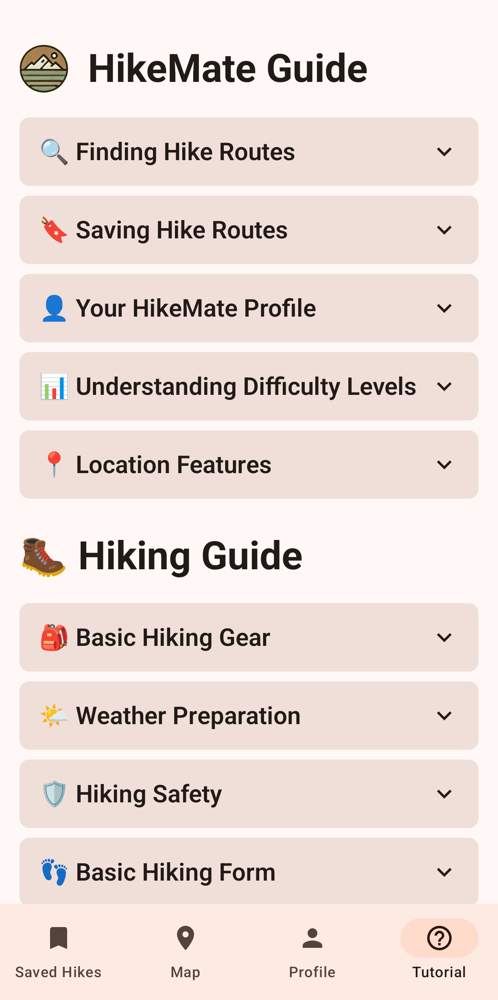
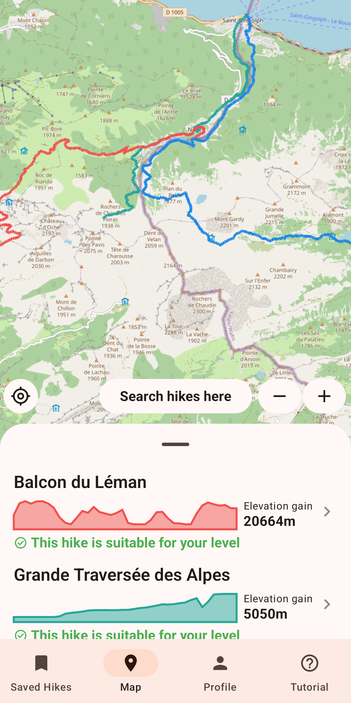
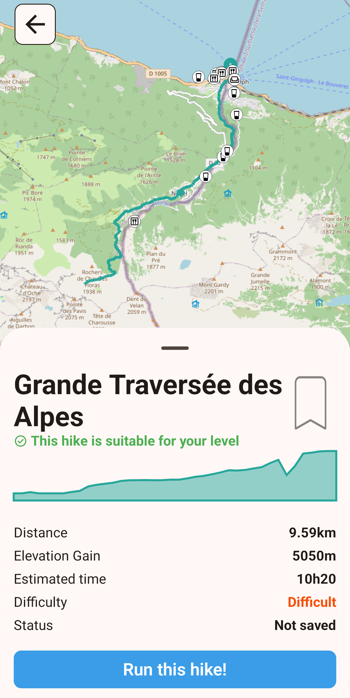
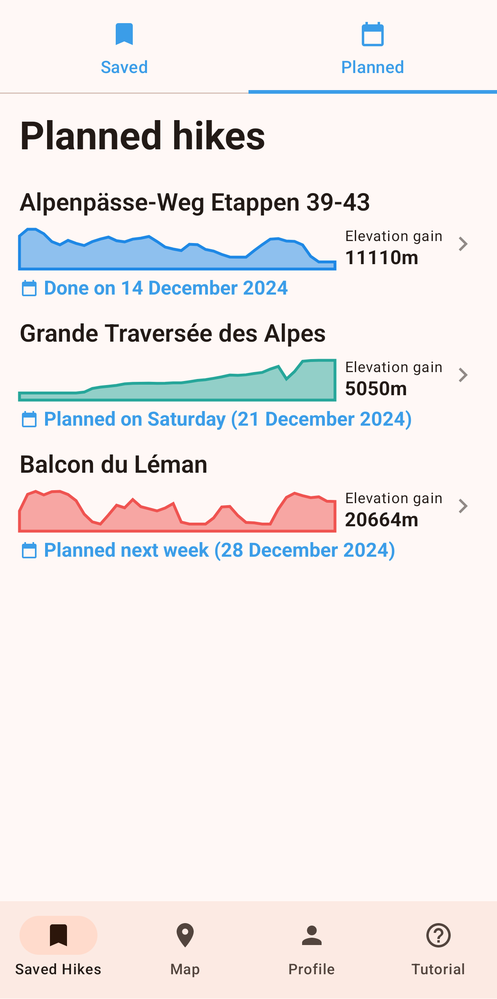
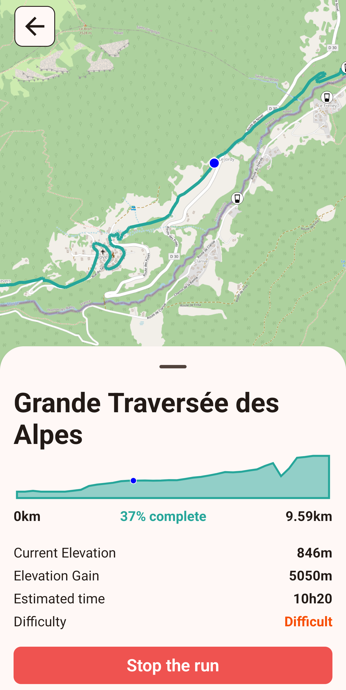

<h1 align="center">HikeMate</h1>
<p align="center">
    
</p>
<p align="center">
    <a href="https://github.com/HikeMate/hikeMateApp/releases">
        
    </a>
    <a href="https://discord.gg/HjJCwm5">
        
    </a>
</p>

With nature offering incredible benefits for both mental and physical well-being, more people are looking to start hiking as a way to reconnect with the outdoors. However, for beginners, starting out can be overwhelming.

With **HikeMate**, we hope to provide beginners with an easy-to-use, intuitive interface to get started with hiking.

<p align="center">
    
</p>

<p align="center" style="font-style: italic; padding-left: 20%; padding-right: 20%;">
    Take advantage of our numerous, free tutorials on the art and pleasure of hiking.
</p>

<p align="center">
    
</p>

<p align="center" style="font-style: italic; padding-left: 20%; padding-right: 20%;">
    Search for hikes anywhere in the world and get relevant information at a glance to choose a suitable hike.
</p>

<p align="center">
    
</p>

<p align="center" style="font-style: italic; padding-left: 20%; padding-right: 20%;">
    Get more detailed information about a particular hike you are interested in, such as restrooms, trashcans or biergartens on the way.
</p>

<p align="center">
    
</p>

<p align="center" style="font-style: italic; padding-left: 20%; padding-right: 20%;">
    Save hikes you are interested in to easily find them, plan them.
</p>

<p align="center">
    
</p>

<p align="center" style="font-style: italic; padding-left: 20%; padding-right: 20%;">
    Follow your progress in real time while you go hiking.
</p>

Want to give it a try? You can find the APK file in the [releases section](https://github.com/HikeMate/hikeMateApp/releases) of the GitHub repository. You can also use a third-party app such as [Obtainium](https://obtainium.imranr.dev/) to download the app on your phone directly from GitHub.

## Contributing

**HikeMate** is open-source and thus, you can contribute to it by opening PRs and issues.

If you notice a bug or would like to request a feature, feel free to [open an issue](https://github.com/HikeMate/hikeMateApp/issues/new) on the repo. You can also work on the bug fix/feature yourself and open a PR.

### Building the app

To build the app for yourself, clone the current repository and open it as an [Android Studio](https://developer.android.com/studio) project. For reference, we used a few patches of Android during the project, the last one being `Android Ladybug 2024.2.1 Patch 3`.

You can build **HikeMate** like any other app you would with Android Studio, no additional setup involved.

### Running the tests locally

To run the project tests locally, open the [Run Anything](https://www.jetbrains.com/help/idea/running-anything.html#open_run_anything_popup) dialog of Android Studio, and type

```
gradle check connectCheck jacocoTestReport
```

This will run unit tests (`test` folder), integration tests (`androidTest` folder) and generate a Jacoco code coverage report.

Depending on your needs, you might as well remove the `jacocoTestReport` or run only `check`/`connectCheck`.

> [!NOTE]
> Integration tests (`connectCheck`, in the `androidTest` folder) require you to have an emulator or a connected Android device, as those tests have to be run in an actual Android context.

### Getting familiar with the codebase

If you intend to contribute, you might want to first spend a little time understanding how the app works in its current state.

The first thing you might want to do is read about MVVM (Model-View-ViewModel), as the app follows a similar architecture.

As for the app itself, there are a few resources you can use such as

- Our **architecture diagram** will give you a broad view of the components of the app (screens, view models, repositories) and how they interact. The diagram is available on [Excalidraw](https://excalidraw.com/#json=HWkgLdhejIEzjL0Vuz7Ar,pG7H5PR27iZM6gQDCkj14A) or as an [SVG](images/architecture-diagram-m3.svg).

- Our [Figma mockup and wireframe](https://www.figma.com/design/EOM0DPxmM1FzGwxFeoItsE/Untitled?node-id=0-1&m=dev) will give you an idea of what we envisioned, with a few features that are not implemented yet.

- The code itself contains documentation (docstrings) that can help you particular functions, attributes and state flows.

- Finally, our [wiki](https://github.com/HikeMate/hikeMateApp/wiki) should provide you with guidance about organization (branch naming conventions, the process to follow when working on a PR, ...) plus give you some ideas of features that are not implemented yet you could work on.

Thank you for your interest in this project, feel free to open a PR or an issue if you are interested in contributing!